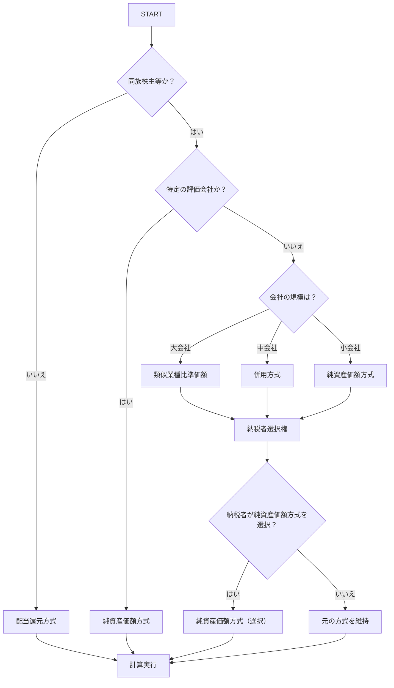

# 評価方式決定ロジックツリー - Stock Valuator Pro

## 概要
非上場株式の評価方式を決定するための論理的な判定フローを定義します。このロジックツリーは、アプリケーションの頭脳となる判定ロジックそのもので、ユーザーの回答に応じて、どの計算方式を適用すべきかを分岐させる、バックエンドAPIの中核をなしています。

## 評価方式決定ロジックツリー



## 詳細判定基準

### 1. 同族株主等の判定

#### 判定基準
- **同族株主等に該当する場合:**
  - 被相続人とその親族等が、その会社の発行済株式の総数又は出資の総額の50%を超える株式又は出資を有している場合
  - 被相続人とその親族等が、その会社の議決権の過半数を有している場合

#### 判定結果
- **該当する場合:** 次の判定（特定の評価会社）に進む
- **該当しない場合:** 配当還元方式を適用

### 2. 特定の評価会社の判定

#### 判定基準
- **特定の評価会社に該当する場合:**
  - 証券取引所に上場されている会社
  - 店頭公開されている会社
  - その他、国税庁長官が定める会社

#### 判定結果
- **該当する場合:** 純資産価額方式を適用
- **該当しない場合:** 会社規模の判定に進む

### 3. 会社規模の判定

#### 判定基準（業種別）

##### 製造業、建設業、運輸業、その他の業種
- **大会社:** 資本金5億円超 または 従業員数1,000人超
- **中会社:** 資本金1億円超5億円以下 かつ 従業員数100人超1,000人以下
- **小会社:** 資本金1億円以下 または 従業員数100人以下

##### 卸売業
- **大会社:** 資本金1億円超 または 従業員数100人超
- **中会社:** 資本金1,000万円超1億円以下 かつ 従業員数50人超100人以下
- **小会社:** 資本金1,000万円以下 または 従業員数50人以下

##### 小売業
- **大会社:** 資本金5,000万円超 または 従業員数50人超
- **中会社:** 資本金1,000万円超5,000万円以下 かつ 従業員数30人超50人以下
- **小会社:** 資本金1,000万円以下 または 従業員数30人以下

##### サービス業
- **大会社:** 資本金5,000万円超 または 従業員数100人超
- **中会社:** 資本金1,000万円超5,000万円以下 かつ 従業員数50人超100人以下
- **小会社:** 資本金1,000万円以下 または 従業員数50人以下

#### 判定結果
- **大会社:** 類似業種比準価額を適用
- **中会社:** 併用方式を適用
- **小会社:** 純資産価額方式を適用

### 4. 納税者選択権の判定

#### 選択可能な場合
- **大会社・中会社の場合:** 納税者は、原則の方式に加えて、純資産価額方式を選択することができる
- **小会社の場合:** 選択権なし（純資産価額方式のみ）

#### 選択結果
- **純資産価額方式を選択:** 純資産価額方式で計算
- **選択しない:** 原則の方式で計算

## 計算方式の詳細

### 1. 配当還元方式
```
評価額 = 1株当たりの配当金額 ÷ 配当還元率 × 発行済株式総数
```

### 2. 純資産価額方式
```
評価額 = 1株当たりの純資産価額 × 発行済株式総数
1株当たりの純資産価額 = （資産の合計額 - 負債の合計額） ÷ 発行済株式総数
```

### 3. 類似業種比準価額方式
```
評価額 = 1株当たりの類似業種比準価額 × 発行済株式総数
1株当たりの類似業種比準価額 = 類似業種の株価 × 調整係数
```

### 4. 併用方式
```
評価額 = （類似業種比準価額 × 0.7 + 純資産価額 × 0.3）× 発行済株式総数
```

## 実装上の注意点

### 1. データ検証
- 入力値の妥当性チェック
- 必須項目の確認
- 数値範囲の検証

### 2. エラーハンドリング
- 判定不能の場合の処理
- 計算エラーの処理
- ユーザーへの適切なフィードバック

### 3. パフォーマンス
- 判定ロジックの最適化
- 計算処理の効率化
- レスポンス時間の確保

## 将来の拡張性

### 1. 税法改正への対応
- 判定基準の更新機能
- 計算式の修正機能
- 新しい評価方式の追加

### 2. 業種別対応の拡大
- 新業種の追加
- 業種別判定基準の細分化
- 業界特化の計算ロジック

### 3. AI活用の可能性
- 判定精度の向上
- 異常値の検出
- 推奨事項の提示 