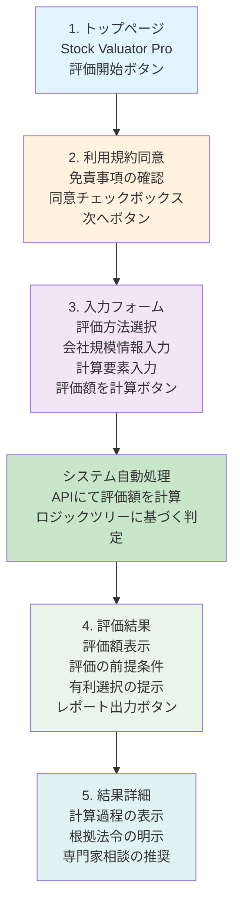

# 画面遷移図（ワイヤーフレーム） - Stock Valuator Pro

## 概要
このワイヤーフレームは、ユーザーがアプリをどのように操作するかの流れを示した骨格です。フロントエンドの各画面（コンポーネント）が、この流れに沿って実装されています。

## 画面遷移フロー



## 詳細画面仕様

### 1. トップページ

#### レイアウト構成
```
┌─────────────────────────────────────┐
│            Stock Valuator Pro       │
│        非上場株式評価アプリ         │
│                                     │
│  ┌─────────────────────────────┐    │
│  │        評価開始             │    │
│  └─────────────────────────────┘    │
│                                     │
│  【免責事項】                      │
│  本アプリはシミュレーションです     │
│  実際の申告には専門家にご相談ください│
└─────────────────────────────────────┘
```

#### 要素詳細
- **ヘッダー:** アプリ名とサブタイトル
- **メインボタン:** 評価開始ボタン（目立つデザイン）
- **免責事項:** 重要な注意書き（小さめのフォント）

### 2. 利用規約同意ページ

#### レイアウト構成
```
┌─────────────────────────────────────┐
│           利用規約・免責事項        │
│                                     │
│  ┌─────────────────────────────┐    │
│  │ □ 利用規約に同意します      │    │
│  └─────────────────────────────┘    │
│                                     │
│  【重要なお知らせ】                 │
│  • 本アプリはシミュレーションです   │
│  • 実際の申告には専門家にご相談     │
│  • 開発者は一切の責任を負いません   │
│                                     │
│  ┌─────────────────────────────┐    │
│  │           次へ             │    │
│  └─────────────────────────────┘    │
└─────────────────────────────────────┘
```

#### 要素詳細
- **チェックボックス:** 同意の確認（必須）
- **免責事項:** 詳細な説明
- **次へボタン:** 同意後に有効化

### 3. 入力フォームページ

#### レイアウト構成
```
┌─────────────────────────────────────┐
│           情報入力                  │
│                                     │
│  【基本情報】                       │
│  評価方法: ○ 原則  ○ 特例         │
│                                     │
│  【会社規模情報】                   │
│  業種: [選択]                       │
│  資本金: [入力] 万円                │
│  従業員数: [入力] 人                │
│                                     │
│  【計算要素】                       │
│  発行済株式総数: [入力] 株          │
│  純資産額: [入力] 万円              │
│  配当金額: [入力] 万円              │
│                                     │
│  ┌─────────────────────────────┐    │
│  │        評価額を計算         │    │
│  └─────────────────────────────┘    │
└─────────────────────────────────────┘
```

#### 要素詳細
- **セクション分け:** 論理的な情報のグループ化
- **入力フィールド:** 適切なラベルとプレースホルダー
- **バリデーション:** リアルタイムでの入力チェック

### 4. 評価結果ページ

#### レイアウト構成
```
┌─────────────────────────────────────┐
│           評価結果                  │
│                                     │
│  ┌─────────────────────────────┐    │
│  │      評価額: 1,500万円      │    │
│  └─────────────────────────────┘    │
│                                     │
│  【評価の前提】                     │
│  会社規模: 中会社                   │
│  適用方式: 併用方式                 │
│  計算根拠: 類似業種比準価額70% +    │
│           純資産価額30%            │
│                                     │
│  【有利選択の提示】                 │
│  純資産価額方式: 1,200万円          │
│  （より有利な場合のみ表示）         │
│                                     │
│  ┌─────────────────────────────┐    │
│  │        詳細を見る           │    │
│  └─────────────────────────────┘    │
└─────────────────────────────────────┘
```

#### 要素詳細
- **結果表示:** 大きく目立つデザイン
- **前提条件:** 透明性のための詳細表示
- **有利選択:** ユーザー利益の最大化

### 5. 結果詳細ページ

#### レイアウト構成
```
┌─────────────────────────────────────┐
│           計算詳細                  │
│                                     │
│  【計算過程】                       │
│  1. 同族株主等の判定: 該当          │
│  2. 特定評価会社の判定: 該当しない  │
│  3. 会社規模の判定: 中会社          │
│  4. 適用方式の決定: 併用方式        │
│                                     │
│  【計算式】                         │
│  類似業種比準価額: 1,800万円        │
│  純資産価額: 1,200万円              │
│  評価額 = 1,800×0.7 + 1,200×0.3    │
│        = 1,500万円                  │
│                                     │
│  【根拠法令】                       │
│  相続税法施行令第24条               │
│  財産評価基本通達177-1              │
│                                     │
│  ┌─────────────────────────────┐    │
│  │      専門家に相談する       │    │
│  └─────────────────────────────┘    │
└─────────────────────────────────────┘
```

#### 要素詳細
- **計算過程:** ステップバイステップの説明
- **計算式:** 具体的な数値と計算方法
- **根拠法令:** 法的根拠の明示

## レスポンシブデザイン対応

### デスクトップ版（1200px以上）
- 2カラムレイアウト
- サイドバーに補足情報
- 大きなフォントサイズ

### タブレット版（768px-1199px）
- 1カラムレイアウト
- 適度な余白
- タッチ操作に配慮

### モバイル版（767px以下）
- 縦スクロール中心
- 大きなタッチターゲット
- 簡潔な表示

## アクセシビリティ対応

### 視覚的アクセシビリティ
- 十分なコントラスト比（4.5:1以上）
- フォントサイズの調整機能
- 色だけでなく形状でも情報を表現

### 操作的アクセシビリティ
- キーボードでの操作対応
- スクリーンリーダー対応
- フォーカス管理の適切な実装

### 認知的アクセシビリティ
- 分かりやすい用語の使用
- 段階的な情報提示
- エラー時の分かりやすい説明

## エラー状態の設計

### 入力エラー
- リアルタイムでのバリデーション
- 具体的なエラーメッセージ
- 修正方法の提示

### システムエラー
- ユーザーフレンドリーなエラーメッセージ
- 再試行の案内
- サポート情報の提供

### ネットワークエラー
- 接続状態の表示
- オフライン対応
- データの自動保存

## 将来の拡張予定

### 機能拡張
- 計算履歴の保存
- 比較機能の追加
- レポート出力機能

### UI/UX改善
- ダークモード対応
- 多言語対応
- パーソナライゼーション機能 